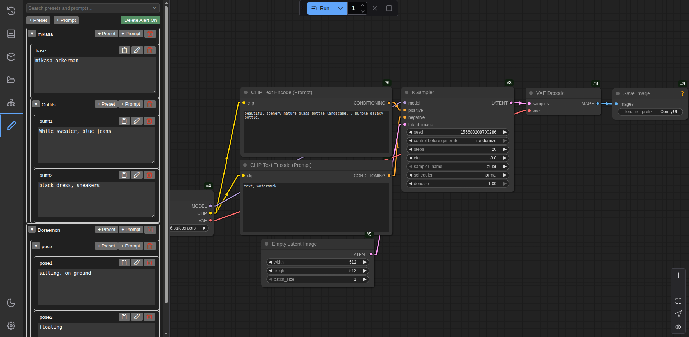

# ComfyUI Prompt Bank

ComfyUI Prompt Bank is a ComfyUI extension to add a prompt bank to the sidebar of the default frontend, allowing easy storing of prompt presets.

Save presets for a character, a series, a scenary etc. with ease. Save multiple costumes, hairstyles, or poses for your favourite characters!

### Features
- Easily accessible prompt menu from sidebar
- Prompt or preset (group of presets/prompts) storing
- Nested presets!
- Click to copy feature
- Preset/Prompt Titles: name your presets/prompts
- Preset/Prompt Search: find what you need quicker!

### Installation
- Install by cloning this repository into ComfyUI/custom_nodes
- Installation by ComfyUI Manager coming soon

### Usage
- Create Presets/Prompts: Click on `+ Preset` or `+ Prompt` to add preset or prompt block
- Prompt Editing: Click on **pencil icon** or **double click** textbox to edit prompt
- Title Editing: **Double click** on titles to edit
- Deleting: Click **trash icon** to delete preset or prompt (Toggle `Delete Alert` to toggle delete confirmation)
- Copying: Click on the textbox to copy the prompt
- Pasting: Click on **clipboard icon** to paste into prompt (**WILL OVERWRITE CURRENT CONTENT**)
- Searching: Search for preset/prompts by title or prompt content
  - In search mode clicking any preset/prompt will reset search and highlight the whole searched the preset

### Why?
Saving prompts within images while is quite visual, it is not that simple to manage and navigate when you got tons of images. Added that it requires a bunch of clicks to retrieve your prompts when your workflow is slightly more than basic. I have always wanted an easy and quick prompt manager where one can store prompts and also group them by character or something. So this is pretty much what I envisioned, have at it!

### Roadmap
- [ ] Save settings
- [ ] Copy multiple prompts
- [x] Search function
- [ ] Auto-complete
- [ ] Thumbnails maybe?